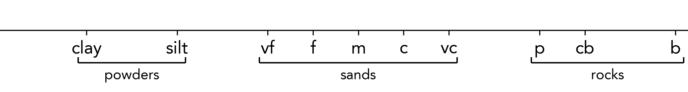
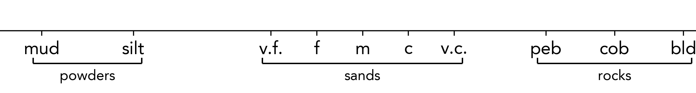

Grain Axis Brackets
============================================

In some cases, one might wish to group similar grain sizes, for example, sand or ash grains. This is carried out by default for all of the available grain size presets discussed in the previous section, but can also be removed, or adjusted manually by passing a dictionary to the ``grain_brackets`` argument of ``sp.load()``. 

This parameter has default values for all of the available grain size presets, which are illustrated below.

.. tab-set::

    .. tab-item:: Sedimentary (default)

        .. code-block:: python

            grain_brackets = {'sand': [3, 5], 'gravel': [6, 6.5]}
            log = sp.load('tutorial.csv', grain_brackets=grain_brackets)

        .. image:: ../../_static/reference/axes_sedimentary.png
            :alt: Sedimentary grain size brackets
            :height: 100px

    .. tab-item:: Volcanic  

        .. code-block:: python

            grain_brackets = {'ash': [1, 2.5], 'lapilli': [3, 4]}
            log = sp.load('tutorial.csv', grain_brackets=grain_brackets)

        .. image:: ../../_static/reference/axes_volcanic.png
            :alt: Volcanic grain size brackets
            :height: 100px

    .. tab-item:: Geological

        .. code-block:: python

            grain_brackets = {}
            log = sp.load('tutorial.csv', grain_brackets=grain_brackets)

        .. image:: ../../_static/reference/axes_geological.png
            :alt: Geological grain size brackets
            :height: 100px

The grain brackets functionality can be removed by passing an empty dictionary to the ``grain_brackets`` argument:

.. code-block:: python

    log = sp.load('file.csv', grain_brackets={})

Alternatively, you can provide a custom dictionary to match either a preset or your own grain sizes provided in ``x_ticks_dict``.

For example, to change the default 'sedimentary' preset's brackets:

.. code-block:: python

    grain_brackets = brackets = {
        'powders': (1, 2),
        'sands': (3, 5),
        'rocks': (6, 7.5)
    }
    log = sp.load('file.csv', grain_brackets=grain_brackets)

Alternatively, we can specify a custom dictionary of grain sizes and brackets:

.. code-block:: python

    x_ticks = { 'mud': .5, 'silt': 1.5, 'v.f.': 3, 'f': 3.5, 'm': 4, 'c': 4.5, 'v.c.': 5, 'peb': 6, 'cob': 6.75, 'bld': 7.5 }
    brackets = { 
        'powders': (.5, 1.5), 
        'sands': (3, 5), 
        'rocks': (6, 7.5) 
    }
    log = sp.load('file.csv', x_ticks_dict=x_ticks, grain_brackets=brackets)

