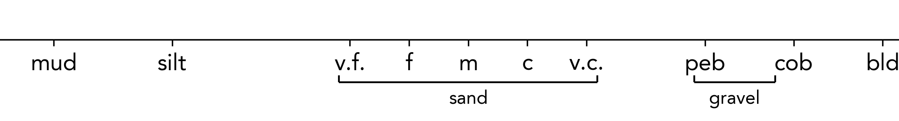

Grain Axis Values
==========================================

As mentioned in :doc:`/getting_started/tutorial/file_format`, the labels and positions of the grain size markers on the x-axis of logs can be adjusted. You may wish to do this to change the positions and values of the grain sizes.

By default, a range of grain sizes for sedimentological purposes are provided, however, other presets are available and can be used through the ``grain_preset`` argument in ``sp.load()``, for example:

.. code-block:: python

    log = sp.load('my_log.csv', grain_preset='volcanic')

This will change how stratapy interprets the grain size labels in your input file, and will also change the labels and positions of the grain size markers on the x-axis of your log. 

The following presets are available:

.. tab-set::

    .. tab-item:: Sedimentary (default)

      .. list-table::
        :header-rows: 0
        :stub-columns: 1

        * - key
          - clay
          - silt
          - vf
          - f
          - m
          - c
          - vc
          - p
          - cb
          - b
        * - value
          - 1
          - 2
          - 3
          - 3.5
          - 4
          - 4.5
          - 5
          - 6
          - 6.5
          - 7.5

      .. image:: ../../_static/reference/axes_sedimentary.png
          :alt: Sedimentary grain sizes
          :height: 100px

    .. tab-item:: Volcanic

      .. list-table::
        :header-rows: 0
        :stub-columns: 1

        * - key
          - vf
          - f
          - m
          - c
          - f^
          - m^
          - c^
          - block/bomb
        * - value
          - 1
          - 1.5
          - 2
          - 2.5
          - 3
          - 3.5
          - 4
          - 5

      .. image:: ../../_static/reference/axes_volcanic.png
          :alt: Volcanic grain sizes  
          :height: 100px

    .. tab-item:: Geological

      .. list-table::
        :header-rows: 0
        :stub-columns: 1

        * - key
          - clay
          - silt
          - sand
          - gravel
          - cobble
          - boulder
        * - value
          - 1
          - 1.5
          - 2.5
          - 4
          - 5
          - 6

      .. image:: ../../_static/reference/axes_geological.png
          :alt: Geological grain sizes
          :height: 100px

.. note::
   Any of the following punctuation characters can be used to create multiple grain size labels with duplicate names: ``* ^ & _ £ $``. This is useful when you want to display multiple grain size axes with the same labels but different values on a single plot. For example, this method is used for the 'volcanic' preset above to create both fine, medium, and coarse ash ('f', 'm', 'c') as well as fine, medium, and coarse lapilli ('f^', 'm^', 'c^').

In addition to these presets, you can also fully customise the grain size labels and positions. This may be desired to customise the labels to your own terminology, or to change the positions of the grain sizes on the x-axis.

``sp.load()`` takes another optional argument, ``x_ticks_dict``, which is a dictionary with keys for the grain size labels, and values for their corresponding numerical values. 

As an example, below we change the labels and positions of the default sedimentology preset:

.. code-block:: python

    x_ticks = {
      'mud': .5,
      'silt': 1.5,
      'v.f.': 3,
      'f': 3.5,
      'm': 4,
      'c': 4.5,
      'v.c.': 5,
      'peb': 6,
      'cob': 6.75,
      'bld': 7.5
    }
    log = sp.load('file.csv', x_ticks_dict=x_ticks)

This dictionary causes sand grains to be more compact, as is often desired. However, these keys and values can be changed, removed, or new ones can be added to suit your needs. 

.. tip::
  Now that the grain size labels are different, any input files which use the strings of the original preset will not be recognised. For example, ``vf`` will need to be changed to ``v.f.``. Using numerical values in your input files can provide more flexibility.

.. note::

  Even with customised gain axes, only grains up to the largest grain in your file will be displayed in the x-axis limits. If the entire range of grains is desired, even if not present in the data, you can use the ``set_xlim()`` method of a Matplotlib axis object to manually set the x-axis limits after plotting (more details about such customisation can be found in :doc:`/customisation/advanced_plotting/custom_figure_layouts`).

  If you have specified your input files using the default labels, and then change them, you may encounter errors or unexpected visualisation behaviour if these files are then used with new custom ``x_ticks_dict`` values. You may wish to use only numerical values in your inputs to avoid any such issues.