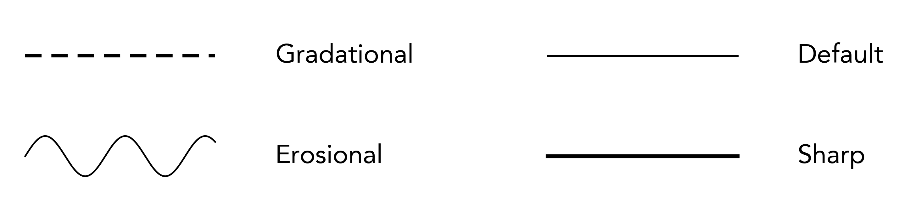

File Format
===========================

Stratapy uses `CSV` (comma separated variable) formatted files to convert data into visualisations. Input files are accepted in various formats: ``.csv``, ``.txt``, and ``.xlsx``. You can make these files yourself, or an Excel template with selectable options can be downloaded **here**. [not yet available].

Files should contain rows for each unit to be displayed, with columns specifying various parameters for that unit. The table below lists all of the column types. At a minimum, the `height/age` and `rock` columns must be filled, but all others are optional. Further customisations to graphics beyond this input file can be specified later using stratapy itself.

.. list-table:: 
    :header-rows: 1

    * - Column Name
      - Example Values
      - 
      - Description
    * - :ref:`height-age`
      - 80
      - 100.5
      - Height or age value of the top of the unit, numerical values only.
    * - :ref:`rock`
      - Sandstone
      - gravel*
      - Rock type or lithology, see complete list of available lithologies at :doc:`/reference/available_assets` . Can be specified using either the lithology name or key.
    * - :ref:`thickness`
      - 2.5
      - 4
      - Thickness of the layer, numerical. Can be left blank and the thickness will be assumed from the 'height/age' column. Thickness of the last unit should be specified, otherwise it will be set to the same value as the penultimate unit.
    * - :ref:`bottom-grain`
      - 4
      - c
      - Grain size at the bottom of the layer, can be numerical or a string in the x-axis labels - see ``bottom_grain`` for more details.
    * - :ref:`top-grain`
      - 2.7
      - m
      - Grain size at the top of the layer, can be numerical or string - see ``bottom_grain`` for more details.
    * - :ref:`connection-type`
      - convex
      - sawtooth
      - Type of contact with underlying layer (e.g., concave, convex, sawtooth). Defaults to ''.
    * - :ref:`erosion`
      - 5
      - -2;1
      - Specifies the amplitude and frequency of the erosional contact at the bottom of each unit; format is ``erosion;frequency``, if left blank, it will be set to zero. See full details in :ref:`erosion`.
    * - :ref:`lenses`
      - clay
      - limestone;sandstone
      - Presence of lenses within a unit. Multiple lenses can be separated by semicolons (e.g., 'clay;limestone').
    * - :ref:`minerals`
      - garnet
      - olivine;quartz
      - Notable minerals present in a unit. Multiple minerals can be separated by semicolons (e.g., 'garnet;olivine').
    * - :ref:`features`
      - trilobite
      - coral;brachiopod
      - Fossils or sedimentary structures present in a unit. Multiple features can be separated by semicolons (e.g., 'trilobite;coral').
    * - :ref:`contact`
      - erosional
      - hard
      - Type of contact on the bottom of the unit. Options include 'gradational', 'hard' or 'erosional'.

.. _height-age:

.. rubric:: height/age

The height or age of the top of the unit. Rows should be entered in :abbr:`monotonically (in a way where values only ever increase or decrease)` increasing order for age-based figures, or monotonically decreasing order for depth- or height-based figures. Depth and height are determined automatically depending on whether there are more negative or positive values, respectively.

.. _rock:

.. rubric:: rock

The rock type or lithology of the unit. This can be any lithology's 'key' (e.g. ``607``) or name (e.g. ``limestone``) from the :doc:`/reference/available_assets` list. Lithology names must match those in the available list; stratapy will try to inform you of nearby matches upon if a passed value is not available. 

All lithological patterns all are black and white by default, however, all labelled patterns have a coloured version which can be used by appending '*' to the key, e.g. ``6038``, or ``limestone*``.

Patterns, colours, and labels, of lithologies can be adjusted, and custom lithologies can be added for use using the :py:meth:`stratapy.core.StratigraphyPackage.add_lithology` method - see :doc:`/customisation/adjusting_assets/lithologies` for full details.

.. _thickness:

.. rubric:: thickness

The thickness of the unit. If left blank, the thickness will be assumed from the difference between the height/age of the current and next unit. The thickness of the last unit should be specified, otherwise it will be set to the same value as the penultimate unit.

.. _bottom-grain:

.. rubric:: bottom_grain

The grain size at the bottom of the unit. This value can either be a number (float) or string corresponding to one of the grain sizes or their label names. By default, the labels and their corresponding numbers are as given below.

It may be more convenient to specify using strings, however, for more precise control over unit placement (e.g., having a grain size between silt and very fine sand) numerical inputs may be desired. Numerical and string inputs can be mixed in the same file.

A value of 5.9 would place the grain size just below 'very coarse sand', displaying the next label up (i.e., 'very coarse sand') on the x-axis. Setting this value to 6.0 would then cause the next label to be displayed (i.e., 'gravel').

.. list-table::
  :header-rows: 0
  :stub-columns: 1

  * - Grain Size
    - clay
    - silt
    - very fine sand
    - fine sand
    - medium sand
    - coarse sand
    - very coarse sand
    - gravel
    - pebble
    - boulder
  * - Label Name
    - clay
    - silt
    - vf
    - f
    - m
    - c
    - vc
    - g
    - p
    - b
  * - Value
    - 1
    - 2
    - 3
    - 3.5
    - 4
    - 4.5
    - 5
    - 6
    - 7
    - 8

For more customised control over the grain size labels and values, these values can be modified - see :doc:`/customisation/grain_size/index` for more details.

.. _top-grain:

.. rubric:: top_grain

The grain size at the top of the unit, follows the same rules as ``bottom_grain``.

.. _connection-type:

.. rubric:: connection_type

The type of 'cap' on the right-hand side of a unit. This can be any of the following: 'concave', 'convex', 'sawtooth', 'sawtooth_r' or left blank for no contact. Defaults to '' (blank).

Sawtooth or its reverse (sawtooth_r) displays three triangular peaks on the right-hand side of the unit. Concave and convex display a curved cap, with the curve facing inwards or outwards, respectively.

Combined units (where the same lithology is present in consecutive rows) will be plotted as one unit, but each sub-unit can have a different connection type. If any of the sub-units' connection_type value contains `^` (e.g., 'concave^' or ^'sawtooth'), a smoothing algorithm will be applied to the right-hand side of the entire combined unit. Note, this may not always give the desired result, particularly when there is a high level of complexity in the sub-units.

.. _erosion:

.. rubric:: erosion

If a sinusoidal erosional contact is desired between two units, this column specifies the amplitude and frequency of that indicator at the bottom of a unit. If left blank, it will be ignored.

The format is ``erosion;frequency``, where `erosion` is the amplitude of the sine wave (in the same units as the height/age column), and `frequency` is the number of troughs and peaks within each unit of the x-axis. The amplitude can be positive or negative - a negative amplitude will invert the sine wave (i.e., a 180 degree phase shift). If only one value is provided (e.g., ``4``), it will be taken as the amplitude, and frequency will kept to a default. If frequency is set to 0, no erosion will be displayed, even if an amplitude is provided.

Note that the total height (peak to trough) of the sinusoidal indicator is twice the amplitude. Some examples are provided in the image below:

.. TODO

.. _lenses:

.. rubric:: lenses

If lenticular lenses are desired in a unit, any :doc:`/reference/available_assets` can be specified in this column, separated by semicolons (e.g., 'clay;limestone') if more than one lens is present, or multiple lenses of one lithology (e.g., 'clay;clay') are desired.

.. Lenses can be displayed within a unit, or in the features column, depending on the ``lense_mode`` parameter passed to the :py:meth:`stratapy.core.LogObject.plot` method - see :doc:`/getting_started/basic_log_formats/features_mins_lens` for more details.

.. _minerals:

.. rubric:: minerals

If notable minerals are present in a unit, they can be specified in this column, separated by semicolons as with lenses above. 
.. Also similar to lenses, the ``lense_mode`` parameter determines whether these are displayed within the unit or in the features column.

.. _features:

.. rubric:: features

If fossils, or sedimentary/tectonic structures are present in a unit, they can be specified in this column, in the same format as lenses and minerals. Features must be one of the :doc:`/reference/available_assets` list.
.. , and are again displayed following the ``lense_mode`` parameter.

.. _contact:

.. rubric:: contact

To indicate types of contact between units, this column is used to indicate the formatting of the contact at the bottom of a unit. Available options are 'hard', 'gradational', or left blank for the default sharp contact.

Note that the 'erosional' contact type is created automatically when erosion is specified in the ``erosion`` column, and cannot be specified in this column.

.. rubric:: Example Input File

.. Here, we will create a minimal example file for the three x-axis log types: height, depth, and age to illustrate the main columns required to create a basic stratigraphic log. 

The table below shows the input file for the tutorial file which will be used in this documentation. a simple log which we will visualise in this tutorial.

.. csv-table:: Example input file for stratapy
    :file: ../../_static/tutorial.csv
    :header-rows: 1

.. tip::
  Remember, you can `download the accompanying Jupyter Notebook <https://github.com/Jack6228/stratapy/blob/main/examples/Tutorial.ipynb>`_ which accompanies this tutorial, or `use it online through Google Colab <https://colab.research.google.com/github/Jack6228/stratapy/blob/main/examples/Tutorial.ipynb>`_.

.. tip::
    stratapy comes with a number of built-in example files, including the one used in this tutorial, which can be loaded using ``sp.load('examples.XXX.csv')``. For a full list of available example files, run ``sp.list_examples()``. You can also use these example files as templates to create your own input files.