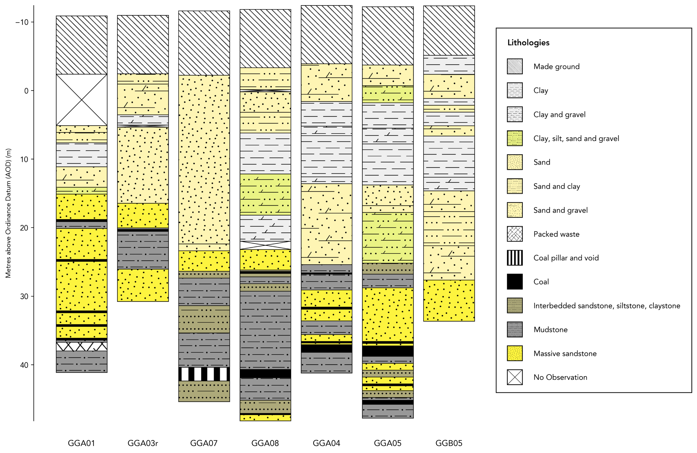
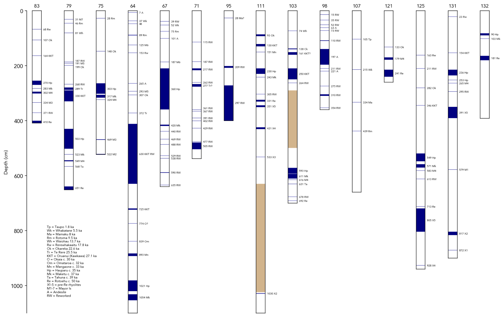
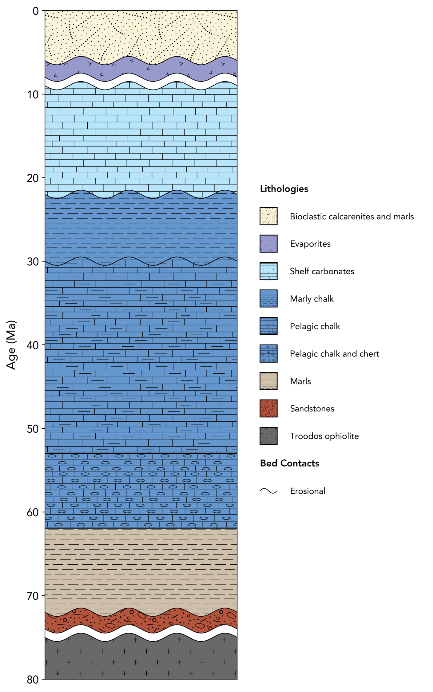
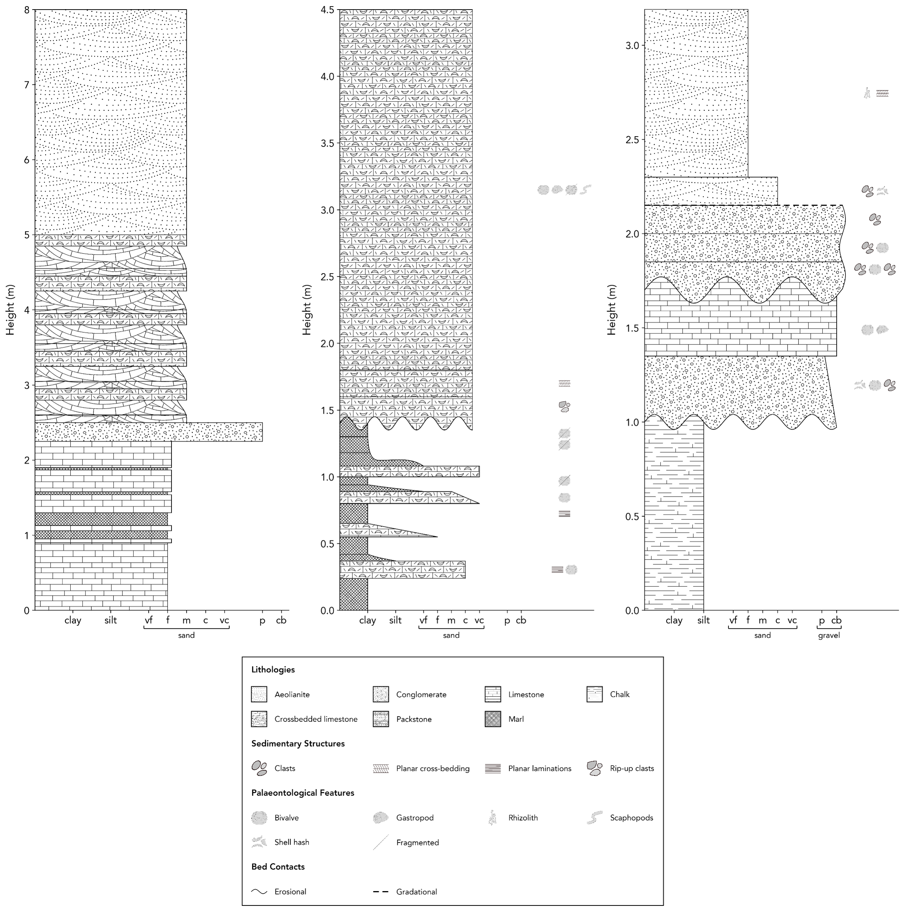
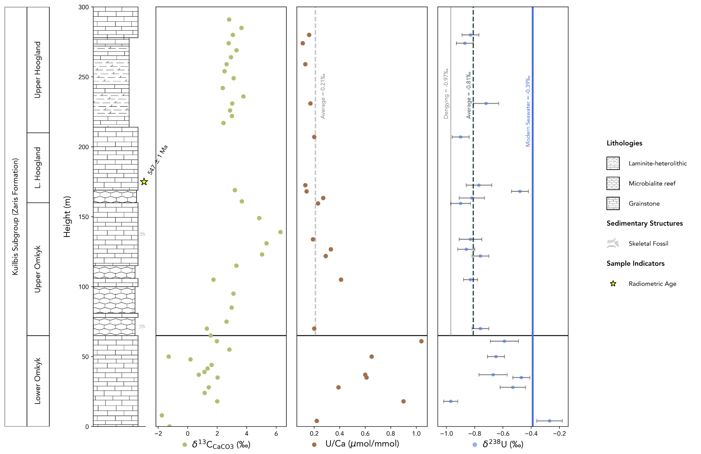

Gallery
==========================

.. note::
   The gallery is currently a work in progress, we expect to add a significant number of new examples soon.

This page presents a comprehensive gallery of example figures produced with stratapy. Click on any figure to access the corresponding example page, which includes the code and data to reproduce the figure.

.. toctree::
   :hidden:          
   :titlesonly:

   ../gallery/UKGeos
   ../gallery/tephrochronology
   ../gallery/cyprusLog
   ../gallery/sedimentaryLogs
   ../gallery/geochemistry

.. tip::

   Use ``Ctrl`` + ``F`` to search for specific keywords within the gallery.

.. rubric:: Aligned Borehole Logs

This example demonstrates a simple stratigraphic column with sedimentary units and annotations.

Keywords: borehole logs, aligned logs, correlated logs

    

.. rubric:: Tephrochronology

This example demonstrates a simple stratigraphic column with sedimentary units and annotations.

Keywords: tephrochronology, tephra, correlated logs, volcanic ash layers, geochronology

.. rubric:: Customised Log

A log showing the depositional history of Cyprus, with customised lithological patterns, colours, and names.

Keywords: custom lithologies, Cyprus, depositional history, sedimentary log

.. rubric:: Multi-figure Sedimentary Logs

Three sedimentary logs are plotted in a single figure, with a shared legend and consistent formatting.

Keywords: multi figure logs, sedimentary logs, shared legend, Cyprus

.. rubric:: Geochemistry

Matplotlib is used to create a custom figure layout where a stratapy log is plotted alongside geochemical data and formation subdivisions. This example also uses the ``log.add_samples`` method to add a formatted point representing a radiometric age.

Keywords: geochemistry, custom figure layout, multi-figure, samples, radiometric age, formation subdivisions, matplotlib

